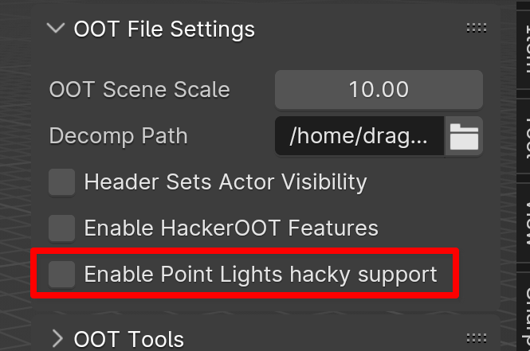
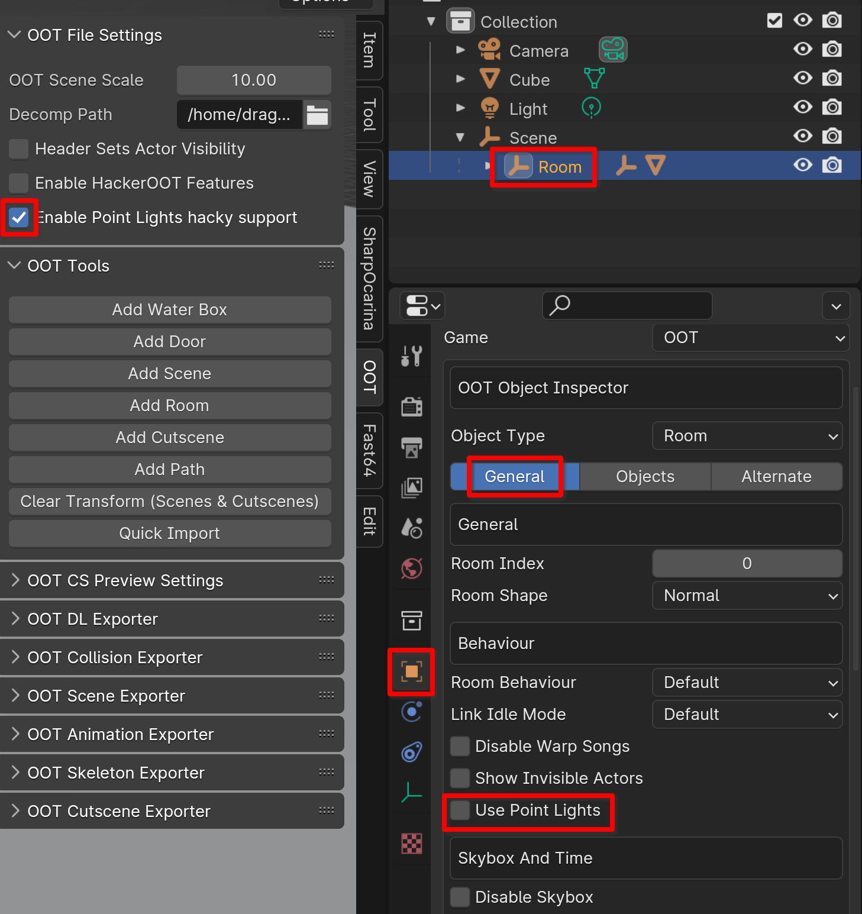
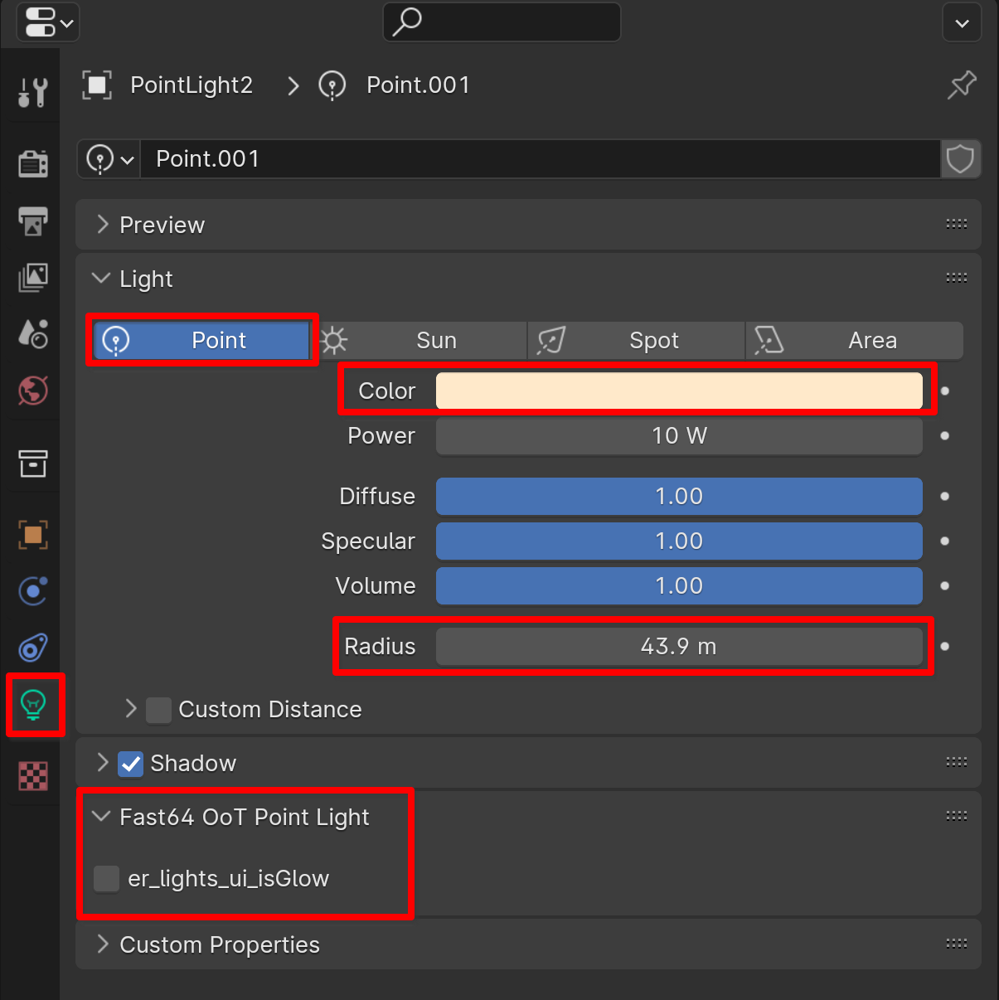

## Exporting geometry with G_LIGHTING_POSITIONAL instead of just G_LIGHTING so it works with point lights:

1) check:



then the `SCENE_CMD_ROOM_BEHAVIOR` will no longer be written, instead of

```c
SCENE_CMD_ROOM_BEHAVIOR(curRoomUnk3, curRoomUnk2, showInvisActors, disableWarpSongs)
```

the Point Light _PL variant will be used:

```c
SCENE_CMD_ROOM_BEHAVIOR_PL(curRoomUnk3, curRoomUnk2, showInvisActors, disableWarpSongs, usePointLights)
```

by default in fast64 usePointLights is false

2) to change the per-room setting usePointLights to enable point lights for the room's geometry:



## Light list

Parent a light to a room to export is as part of a light list using `SCENE_CMD_LIGHT_LIST` (note: separate from `SCENE_CMD_ENV_LIGHT_SETTINGS`)

currently only point lights are supported, other lights are ignored

(cf `room_fill_lightInfoList` in fast64 to change this)

To customize point light properties, change the color and radius (and `er_lights_ui_isGlow` for whether to draw the glow effect, TRUE by default)



note the radius written to file is affected by scene scale, as well as multiplied by an arbitrary factor (cf `PL_RADIUS_SCALE` in fast64 code) to make choosing the radius in blender more natural

FIXME color isn't gamma corrected before writing, may write sRGB when the game reads linear? (may or may not matter visually)
